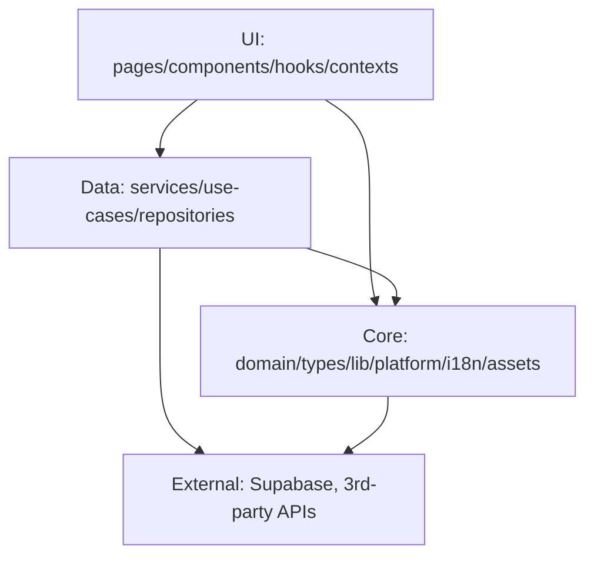

# Dependency Map & Quality Gates

This document defines module boundaries, allowed dependencies, and the commands
used to detect regressions (cycles, layer violations, unused code).

## Stack & Entry Points

- **Framework**: React 18 + Vite.
- **Entrypoint**: `src/main.tsx` mounts the app and configures i18n before render.
- **Routing**: `src/App.tsx` defines route-level pages (React Router).

## Layers & Rules

### Core / Shared
`src/domain`, `src/types`, `src/lib`, `src/platform`, `src/i18n`, `src/assets`

- **May depend on**: other core/shared modules.
- **Must not depend on**: UI or data layers.

### Data / Application
`src/repositories`, `src/services`, `src/use-cases`

- **May depend on**: core/shared and other data modules.
- **Must not depend on**: UI layers.

### UI
`src/components`, `src/hooks`, `src/pages`, `src/contexts`

- **May depend on**: data + core/shared + other UI modules.

### Testing
`src/testing`

- **Test-only**. Production code must not import testing utilities.
- Tests under `__tests__` may import from `src/testing`.

## System Map (High-level)

See also: [Dependency Graph Visualization](./graphs/dependency-graph.mmd)

## Analysis Commands

- `npm run analyze:deps` — dependency list.
- `npm run analyze:cycles` — fail on circular deps.
- `npm run analyze:layers` — fail on layer violations.
- `npm run analyze:unused` — find unused files/exports.
- `npm run quality:gate` — runs cycles + layers + unused checks.

## Known Hotspots (from manual scan)

- **Large files**: `src/platform/supabase/types.ts`, `src/lib/widget-templates.ts`,
  `src/components/admin/AdminAnalyticsDashboard.tsx`.
- **High import fan-out**: `src/components/dashboard/SettingsSidebar.tsx`,
  `src/pages/Dashboard.tsx`, `src/components/editor/MobileSettingsSheet.tsx`.

## Notes

- Generated Supabase types are intentionally ignored by `knip`.
- Use the quality gate scripts in CI or before release to prevent new cycles
  and layer violations.
